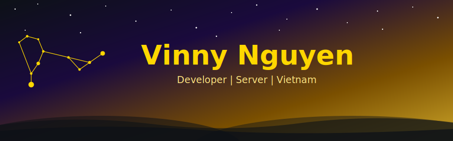

---

## 🧑‍💻 Về tôi / About Me

🇻🇳 Vietnam

---

## 🛠 Kỹ năng & Công nghệ / Skills & Tech Stack

<b>💻 Ngôn ngữ / Languages</b>

 

<b>🖥 Desktop & GUI</b>

 

<b>🌐 Web & Automation</b>

 

<b>📱 Messaging & Social Platforms</b>

 

<b>🤖 AI & Machine Learning</b>

 

<b>🔧 DevOps & Infrastructure</b>

 

<b>🔐 Cybersecurity</b>

 

---

## ⚡ Kinh nghiệm / Experience

| | |
|:---:|:---|
| 📅 | Tham gia từ **tháng 7/2024** |
| 🚀 | Hơn **200 sản phẩm** hoàn thiện — Web · Desktop · Bot · AI · Security · Automation |
| 📣 | **100+ chiến dịch quảng cáo** — Facebook · Google · Telegram · TikTok |
| 🔓 | Mở khóa & vận hành: Sàn điện tử · Facebook · Telegram |
| 🧠 | Một mình từ ý tưởng → sản phẩm chạy production |

---

## 🚀 Dự án / Work

> 🇻🇳 Hầu hết các dự án là **riêng tư**. Contribution graph nói lên tất cả.  
> 🇺🇸 Most work is **private**. The contribution graph speaks for itself.

---

## 📬 Liên hệ / Contact

---

*"Thà bỏ người yêu chứ không thể bỏ Code."*

